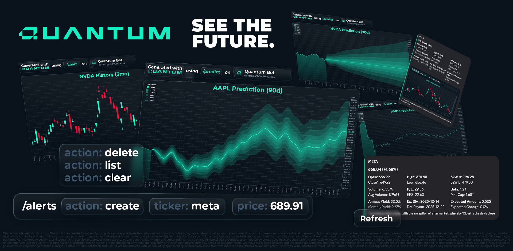

## WE ARE NOW DISCORD VERIFIED! 🥳🥳🥳



[](https://discord.gg/CEtxwANbAy)
[](https://discord.com/oauth2/authorize?client_id=1447285084402094212)
## Quantum 

- Cross Platform (Available on IOS, Android, Desktop Web)
- Prediction:
    - **Implied Volatility (Most Reliable):** Uses a modified Black-scholes implied volatility formula that extracts options data (Calls/Puts) and uses a modified probability density function to display as a fan chart. However, data is less precise if the stock is less popular.
    - **Extrapolation (Fallback):** Uses a modified times-series forecasting model with a custom fourier order and perfected weights. Predicts based on past data, however, does not understand why those patterns appear. However, through multiple phases observing different data ranges (1y, 3y, 5y), it returns with the mean of the data to increase the accuracy.
    - **Aggregate-Extrapolation (Default):** The best of both worlds. It takes both the implied volatility and the extrapolation results and averages the two to get both foresight and hindsight. (Not available if implied volatility data does not exist)
    - **Logical Analysis (Most Accurate):** Takes a consideration of both implied volatility and the extrapolation model and views upcoming events, previous earnings reports, analyst suggestions, latest news, and social media sentiment and feeds it into a proprietary local LLM to return the most accurate prediction. (Requires membership)
- Quote: Returns just the stock quote with an update button to fetch the latest quote fast.
- History Charts: Returns candlestick charts with the latest stock quote. Update button to retrieve latest quote.
    - Past 24 Hours (1d)
    - Past Week (5d)
    - Past Month (1mo)
    - Past 3 Months (3mo)
    - Past 6 Months (6mo)
    - Past Year (1y)
    - Past Year from Today (ytd)
    - Past 2 Years (2y)
    - Past 5 Years (5y)
    - Past 10 Years (10y)
    - Maximum Displayable (all)
- Alerts: Set, delete, clear all, or list all alerts. Alerts can be set at a specific price or can send daily volatility at the end of trading hours.
- Smart Cache: Predictions are updated daily, once generated, the chart image gets cached so further retrieval of the same ticker is quicker. History charts are cached by their period. Charts with a lower period (max, 10y, 5y) are cached for longer.
- Version is live updated by the git commits count. (pretty cool)


## Installation
[](https://discord.com/oauth2/authorize?client_id=1447285084402094212)
## Usage

#### Prediction

```
/predict <ticker> <model>
```

| Parameter | Type     | Description                |
| :-------- | :------- | :------------------------- |
| `ticker` | `string` | **Required**. The symbol to fetch data of. |
| `model` | `string` | *Optional*. The model to use. Default: Aggregate-Extrapolation.|

#### History Charts

```
/chart <ticker> <duration>
```

| Parameter | Type     | Description                |
| :-------- | :------- | :------------------------- |
| `ticker` | `string` | **Required**. The symbol to fetch data of. |
| `duration` | `string` | **Required**. The cutoff of the data. |

#### Live Quote

```
/quote <ticker>
```

| Parameter | Type     | Description                |
| :-------- | :------- | :------------------------- |
| `ticker` | `string` | **Required**. The symbol to fetch data of. |

#### Alerts

```
/alerts <action> <ticker/identifier> <price>
```

| Parameter | Type     | Description                |
| :-------- | :------- | :------------------------- |
| `action` | `string` | **Required**. The action to take. |
| `ticker` | `string` | *Optional*. The symbol to modify. |
| `identifier` | `string` | *Optional*. The ID of the alert object to modify. |
| `price` | `number` | *Optional*. The price to alert at. |

Alerts Usage:


Creating an alert for META at $600:
```
/alerts action:create ticker:meta price:600
```
List every alert (returns identifier)
```
/alerts action:list
```
Deleting an alert from identifier (#1204952):
```
/alerts action:delete identifier:1204952
```
Clear every alert:
```
/alerts action:clear
```

#### Help

```
/help
```
| Parameter | Type     | Description                |
| :-------- | :------- | :------------------------- |
| `none` | `None` | - |

## Future Implementations
- Yahoo news command
- Points system and leaderboard
- Convert points to credits
- Full alerts implementation
- Line chart for chart history
- More in-depth telemetry
- Implementation of the AI
- Compare command
## Support

For support, join the [discord server](https://discord.gg/CEtxwANbAy).

